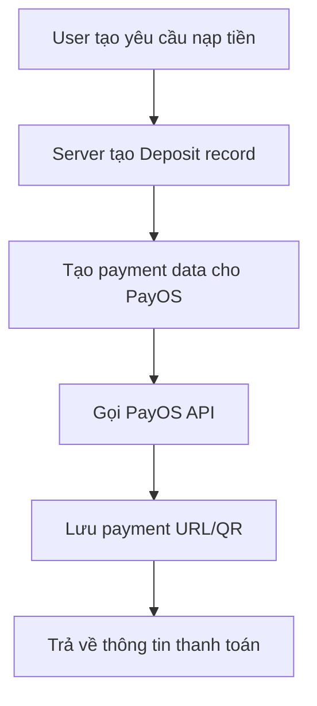
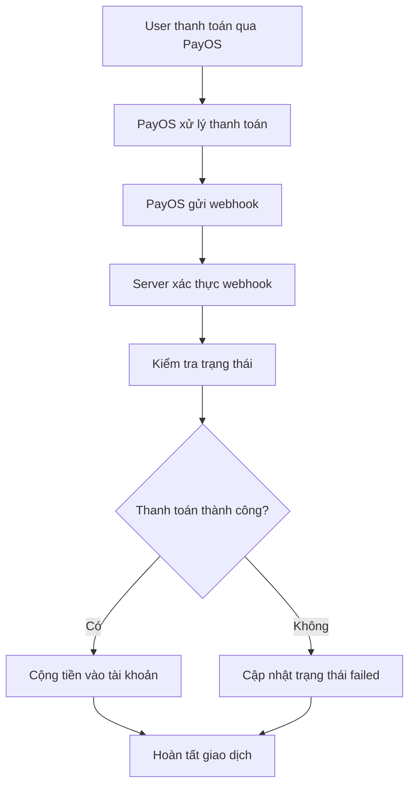

# 🔗 PayOS Integration cho Smart Parking System

## 📋 **Tổng quan**

Tích hợp PayOS để xử lý nạp tiền vào tài khoản người dùng trong hệ thống Smart Parking.

## 🚀 **Tính năng**

### **1. Nạp tiền vào tài khoản**
- ✅ Tạo yêu cầu nạp tiền
- ✅ Tích hợp PayOS payment gateway
- ✅ QR code thanh toán
- ✅ Webhook xử lý kết quả
- ✅ Tự động cộng tiền vào tài khoản

### **2. Quản lý giao dịch**
- ✅ Lịch sử nạp tiền
- ✅ Kiểm tra trạng thái giao dịch
- ✅ Hủy giao dịch
- ✅ Báo cáo doanh thu

## 🔧 **Cài đặt**

### **1. Đăng ký tài khoản PayOS**
1. Truy cập https://business.payos.vn
2. Đăng ký tài khoản merchant
3. Lấy thông tin credentials:
   - Client ID
   - API Key
   - Checksum Key

### **2. Cấu hình Environment Variables**
```env
# PayOS Configuration
PAYOS_CLIENT_ID=your_payos_client_id
PAYOS_API_KEY=your_payos_api_key
PAYOS_CHECKSUM_KEY=your_payos_checksum_key
PAYOS_BASE_URL=https://api-merchant.payos.vn
```

### **3. Cài đặt dependencies**
```bash
npm install axios
```

## 📡 **API Endpoints**

### **Deposits API**

#### **Tạo yêu cầu nạp tiền**
```http
POST /api/deposits/create
Authorization: Bearer <token>
Content-Type: application/json

{
  "amount": 100000,
  "description": "Nạp tiền vào tài khoản"
}
```

**Response:**
```json
{
  "success": true,
  "message": "Tạo yêu cầu nạp tiền thành công",
  "data": {
    "depositId": "64f8a1b2c3d4e5f6a7b8c9d0",
    "orderCode": "DEPOSIT_123_1753607755320",
    "amount": 100000,
    "paymentUrl": "https://pay.payos.vn/...",
    "qrCode": "data:image/png;base64,...",
    "deepLink": "payos://...",
    "status": "pending"
  }
}
```

#### **Lấy danh sách nạp tiền**
```http
GET /api/deposits?page=1&limit=10&status=completed
Authorization: Bearer <token>
```

#### **Chi tiết giao dịch**
```http
GET /api/deposits/:id
Authorization: Bearer <token>
```

#### **Hủy giao dịch**
```http
POST /api/deposits/cancel/:orderCode
Authorization: Bearer <token>
```

#### **Kiểm tra trạng thái**
```http
GET /api/deposits/check/:orderCode
Authorization: Bearer <token>
```

### **Webhook API**

#### **Webhook từ PayOS**
```http
POST /api/deposits/webhook
Content-Type: application/json

{
  "orderCode": "DEPOSIT_123_1753607755320",
  "status": "PAID",
  "transactionId": "TXN123456789",
  "amount": 100000,
  "checksum": "abc123..."
}
```

### **Test API**

#### **Kiểm tra cấu hình PayOS**
```http
GET /api/test-payos/health
```

#### **Test tạo thanh toán**
```http
POST /api/test-payos/create-payment
Content-Type: application/json

{
  "amount": 10000,
  "description": "Test payment"
}
```

## 🗄️ **Database Schema**

### **Deposit Model**
```javascript
{
  userId: ObjectId,           // ID người dùng
  orderCode: String,          // Mã đơn hàng
  amount: Number,             // Số tiền
  description: String,        // Mô tả
  status: String,             // pending/completed/failed/cancelled
  paymentMethod: String,      // payos/bank_transfer/cash
  payosTransactionId: String, // ID giao dịch PayOS
  payosPaymentUrl: String,    // URL thanh toán
  payosQrCode: String,        // QR code
  payosDeepLink: String,      // Deep link
  completedAt: Date,          // Thời gian hoàn thành
  failedReason: String,       // Lý do thất bại
  webhookData: Object,        // Dữ liệu webhook
  ipAddress: String,          // IP người dùng
  userAgent: String           // User agent
}
```

## 🔄 **Quy trình hoạt động**

### **1. Tạo yêu cầu nạp tiền**


### **2. Xử lý thanh toán**


## 🛡️ **Bảo mật**

### **1. Webhook Verification**
- ✅ Xác thực checksum từ PayOS
- ✅ Kiểm tra IP nguồn (nếu cần)
- ✅ Validate dữ liệu webhook

### **2. Rate Limiting**
- ✅ Giới hạn số lần tạo giao dịch
- ✅ Chống spam webhook

### **3. Data Validation**
- ✅ Validate số tiền (tối thiểu 10,000 VNĐ)
- ✅ Validate mô tả
- ✅ Sanitize input data

## 📊 **Báo cáo**

### **1. Thống kê nạp tiền**
- Tổng số giao dịch
- Tổng tiền nạp
- Tỷ lệ thành công
- Thống kê theo thời gian

### **2. Báo cáo doanh thu**
- Doanh thu từ nạp tiền
- Phân tích theo phương thức
- Xuất Excel/CSV

## 🧪 **Testing**

### **1. Test cấu hình**
```bash
curl http://localhost:8080/api/test-payos/health
```

### **2. Test tạo thanh toán**
```bash
curl -X POST http://localhost:8080/api/test-payos/create-payment \
  -H "Content-Type: application/json" \
  -d '{"amount": 10000, "description": "Test payment"}'
```

### **3. Test webhook (local)**
```bash
# Sử dụng ngrok để test webhook
ngrok http 8080
```

## 🔧 **Troubleshooting**

### **1. Lỗi thường gặp**

#### **Webhook không nhận được**
- Kiểm tra URL webhook trong PayOS dashboard
- Kiểm tra firewall/network
- Sử dụng ngrok để test local

#### **Checksum verification failed**
- Kiểm tra PAYOS_CHECKSUM_KEY
- Verify webhook data format
- Check timestamp validity

#### **Payment URL không tạo được**
- Kiểm tra PAYOS_CLIENT_ID và PAYOS_API_KEY
- Verify API endpoint
- Check request payload format

### **2. Logs**
```bash
# Server logs
npm run server

# PayOS service logs
console.log('PayOS createPaymentUrl error:', error);
console.log('Webhook error:', error);
```

## 📚 **Tài liệu tham khảo**

- [PayOS API Documentation](https://docs.payos.vn/)
- [Webhook Guide](https://docs.payos.vn/webhook)
- [Sandbox Testing](https://sandbox.payos.vn/)

## 🎯 **Kết luận**

Tích hợp PayOS đã hoàn thành với đầy đủ tính năng:
- ✅ Tạo thanh toán
- ✅ Xử lý webhook
- ✅ Quản lý giao dịch
- ✅ Báo cáo thống kê
- ✅ Bảo mật toàn diện

**Hệ thống sẵn sàng để triển khai production!** 🚀 